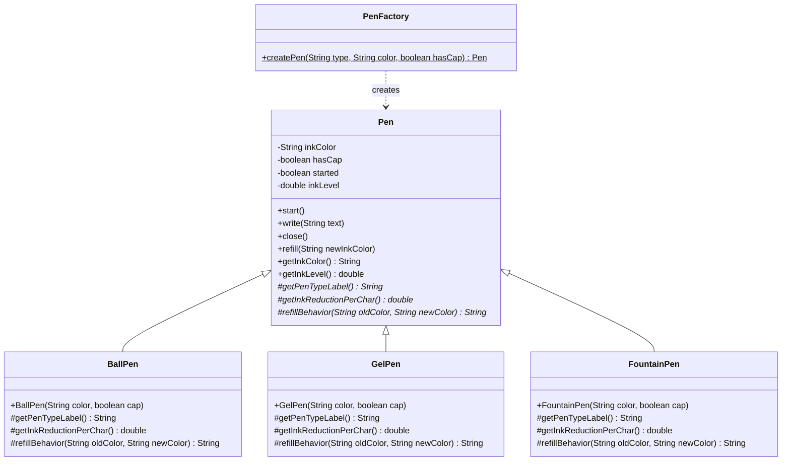

```mermaid
classDiagram
    class Pen {
        -String inkColor
        -boolean hasCap
        -boolean started
        -double inkLevel
        +start()
        +write(String text)
        +close()
        +refill(String newInkColor)
        +getInkColor() String
        +getInkLevel() double
        #getPenTypeLabel() String*
        #getInkReductionPerChar() double*
        #refillBehavior(String oldColor, String newColor) String*
    }

    class BallPen {
        +BallPen(String color, boolean cap)
        #getPenTypeLabel() String
        #getInkReductionPerChar() double
        #refillBehavior(String oldColor, String newColor) String
    }

    class GelPen {
        +GelPen(String color, boolean cap)
        #getPenTypeLabel() String
        #getInkReductionPerChar() double
        #refillBehavior(String oldColor, String newColor) String
    }

    class FountainPen {
        +FountainPen(String color, boolean cap)
        #getPenTypeLabel() String
        #getInkReductionPerChar() double
        #refillBehavior(String oldColor, String newColor) String
    }

    class PenFactory {
        +createPen(String type, String color, boolean hasCap) Pen$
    }

   
    Pen <|-- BallPen
    Pen <|-- GelPen
    Pen <|-- FountainPen
    PenFactory ..> Pen : creates
  
```